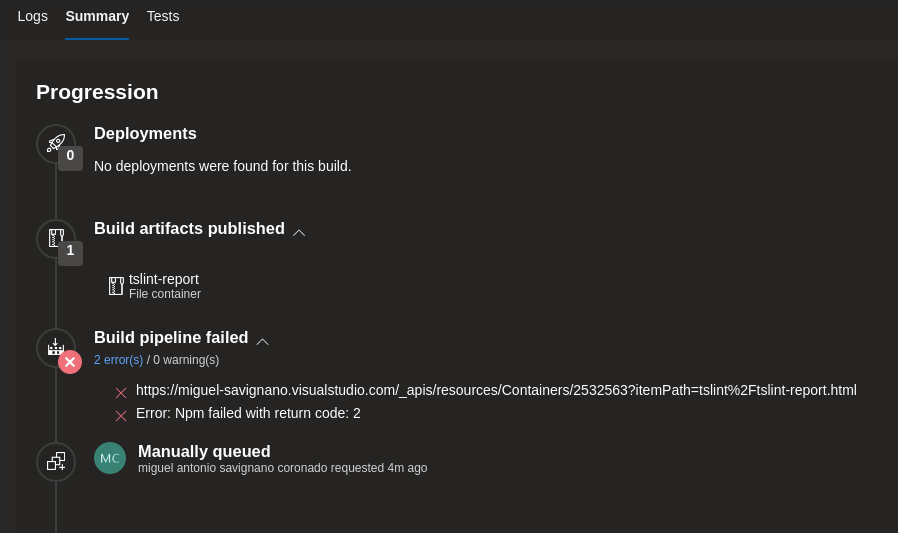

# TSLint report

Pretty tslint result in your azure pipeline


Save report as azure artifacts.



## Configure

Run your tslint

```
tslint -c tslint.json -t json --out tslint-result.json 'src/**/*.ts'
```
